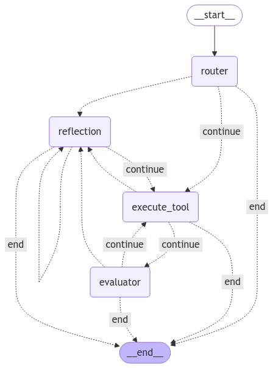
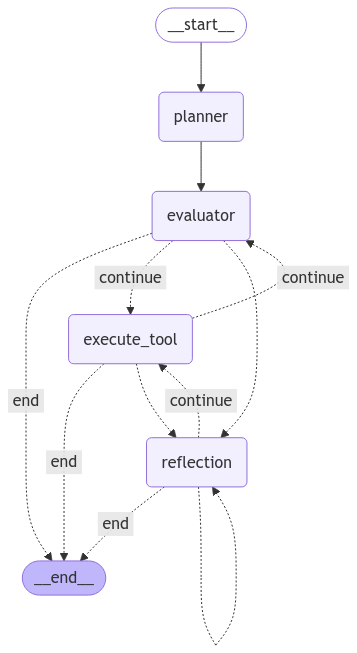

# MAS AI: Multi-Agent System Framework

|                                     |
|:-----------------------------------:|
| |

MAS AI is a powerful framework for building scalable, intelligent multi-agent systems with advanced memory management and flexible collaboration patterns built using langgraph.

- Each agent in mas-ai has different components that work together to achieve the goal.

- Combine such agents in Multi-Agent Systems to achieve more complex goals.

- Combine such Multi-Agent Systems in an Orchestrated Multi-Agent Network (OMAN) to achieve even more complex goals.

## Table of Contents
- [Introduction](#introduction)
- [Supported LLM Categories](#supported-llm-categories)
- [Setting up LLM environment variables](#setting-up-llm-environment-variables)
- [Agent Architecture](#agent-architecture)
- [Memory System](#memory-system)
- [Agent Manager](#agent-manager)
- [Multi-Agent System Workflows](#multi-agent-system-workflows)
- [Orchestrated Multi-Agent Network (OMAN)](#orchestrated-multi-agent-network-oman)
- [Installation](#installation)
- [Usage Examples](#usage-examples)
- [Code Structure](#code-structure)
- [Contributing](#contributing)
- [License](#license)
- [Why MAS AI?](#why-mas-ai)


## Introduction

MAS AI provides a comprehensive framework for building both standalone agents and complex multi-agent systems. The framework offers different agent architectures, robust memory management, and multiple coordination workflows to tackle diverse AI challenges.


## Supported LLM Categories

- OpenAI
- Gemini
- Anthropic
- Gemini
- Groq
- Ollama
- Hugging Face

## Setting up LLM environment variables

- create a .env file and define the LLM API keys

``` .env
OPENAI_API_KEY="your_openai_api_key"
HUGGINGFACEHUB_API_TOKEN="your_huggingface_api_key"
GOOGLE_API_KEY="your_google_api_key"
ANTHROPIC_API_KEY="your_anthropic_api_key"
OLLAMA_BASE_URL="your_ollama_base_url"
GROQ_API_KEY="your_groq_api_key"
```
Put the api key of the category you are using in the .env file.

Then make a model_config.json file in the root directory and define the model name and model category for each component of the agent.

- setup model config in `model_config.json`

This setup gives your finer control over each component of the agent.

### By default models in 'all' are chosen unless specific agent specification is mentioned. Use this by default. Ensure to provide specifications for each agent if this is not used ###

### Optionally if you want different models for a specific agent then mention the models of the components of that agent. In this example only research agent specification is provided. Other two agents will draw it's specification from "all". ###

```json5
{

    "all":{
        "router": {
            "model_name": "gemini-2.0-flash-001",
            "category": "gemini"
        },
        "evaluator": {
            "model_name": "gemini-2.0-flash-001",
            "category": "gemini"
        },
        "reflector": {
            "model_name": "gemini-2.0-flash-001",
            "category": "gemini"
        },
        "planner": {
            "model_name": "gemini-2.0-flash-001",
            "category": "gemini"
        }
    },
    

    "research_agent":{
        "router": {
            "model_name": "gemini-2.0-pro-exp-02-05",
            "category": "gemini"
        },
        "evaluator": {
            "model_name": "gemini-2.0-flash-lite-001",
            "category": "gemini"
        },
        "reflector": {
            "model_name": "gemini-2.0-flash-001",
            "category": "gemini"
        },
        "planner": {
            "model_name": "gemini-2.0-flash-lite-001",
            "category": "gemini"
        }

    }
   
}
```


## Agent Architecture

MAS AI introduces two agent architectures optimized for different use cases:

### 1. Router, Reflector, Evaluator
A reactive architecture for dynamic task routing and output validation:




- **Router:** Analyzes queries and directs them to appropriate processing components
- **Evaluator:** Reviews outputs to ensure quality and relevance
- **Reflector:** Updates memory and improves routing strategies based on outcomes

**Workflow:**
1. Query received → Router analyzes
2. Router delegates to appropriate components
3. Components process the query
4. Evaluator validates the output
5. Reflector updates memory and strategies
6. Return final output

### 2. Planner, Executor, Reflector



A proactive architecture for task planning and dependency management:

- **Planner:** Breaks queries into structured task plans
- **Executor:** Assigns tasks to appropriate components or agents
- **Reflector:** Assesses results and adjusts plans as needed

**Workflow:**
1. Query received → Planner decomposes into tasks
2. Executor distributes and executes tasks
3. Reflector evaluates outcomes and re-plans if necessary
4. Return final output

## Memory System

MAS AI implements a sophisticated memory hierarchy, starting from the smallest unit:

### Agent Memory
- **Short-Term Memory:** Captures immediate chat history, context, and inputs
  - Always enabled; controlled via `memory_order` parameter
  - Essential for contextual understanding

### Component Memory
- **Component Short-Term Memory:** Each component (Router/Evaluator/etc.) maintains its own short-term memory
- **Component Shared Memory:** Communication channel between components within an agent
- **Component Long Short-Term Memory:** Summarized history of past interactions
  - Controlled by `long_context_order` parameter
  - Provides essential context without token overload

### Multi-Agent System Memory
- **Shared Memory:** Memory accessible across all agents in a MAS
  - Default `memory_order = 3`
  - Enables collaborative context awareness
- **Network Memory:** Spans all MAS instances in an OMAN network
  - Controlled by `network_memory_order` parameter


## Agent Manager and Agent Setup Example

The `AgentManager` class is the central hub for creating and managing individual agents:

- setup agent details, tools and then create agent in just few lines.


Creating effective agents requires defining their capabilities, tools, and behavioral characteristics. Below is an example of configuring three specialized agents:

```python
from masai.AgentManager.AgentManager import AgentManager, AgentDetails
from your_module.Tools.searchTools import search_tool, youtube_transcript
from your_module.Tools.baseTools import human_in_loop_input
from your_module.Tools.calendarTools import fetch_calendar_events, manage_calendar_event
from your_module.Tools.emailTools import email_handler
from your_module.Tools.visiontools import Vision_Model

# Initialize the AgentManager
manager = AgentManager(
    logging=True,
    context={"HUMAN_NAME": "Alex", "ORGANIZATION": "Research Lab"},
    model_config_path="model_config.json"
)

# 1. RESEARCH AGENT - specialized in information gathering and analysis
research_details = AgentDetails(
    capabilities=[
        "research", "scientific analysis", "code interpretation",
        "search", "mathematics", "data analysis"
    ],
    description="Researches topics thoroughly using available tools and provides detailed analysis",
    style="analytical and precise with comprehensive explanations" 
)

# 2. PERSONAL ASSISTANT - focused on personalized user interaction
personal_details = AgentDetails(
    capabilities=[
        "personalized conversation", "preference learning",
        "general knowledge", "creative tasks", "memory management"
    ],
    description="Maintains personal context about the user to provide tailored assistance",
    style="friendly, personable with attention to user preferences"
)

# 3. PRODUCTIVITY AGENT - optimized for task and communication management
productivity_details = AgentDetails(
    capabilities=[
        "email management", "scheduling", "task organization",
        "time management", "meeting coordination"
    ],
    description="Handles organizational tasks and manages communications efficiently",
    style="concise, efficient and focused on actionable outcomes"
)

# Define appropriate tools for each agent type
research_tools = [search_tool, youtube_transcript, Vision_Model, human_in_loop_input]
personal_tools = [human_in_loop_input, Vision_Model]
productivity_tools = [email_handler, fetch_calendar_events, manage_calendar_event, human_in_loop_input]

# Create all three agents with their specialized configurations
manager.create_agent(
    agent_name="research_agent",
    tools=research_tools,
    agent_details=research_details,
    plan=False  # Disable planning for simpler operation
)

manager.create_agent(
    agent_name="personal_assistant",
    tools=personal_tools,
    agent_details=personal_details,
    plan=False
)

manager.create_agent(
    agent_name="productivity_agent",
    tools=productivity_tools,
    agent_details=productivity_details,
    plan=False
)

# Verify agent creation
print(f"Created {len(manager.agents)} agents:")
for name in manager.agents:
    print(f"- {name}")
```

Each agent is configured with:
1. **Specialized capabilities** that define their areas of expertise
2. **Relevant tools** that enable specific functionalities
3. **Interaction style** that shapes how they communicate
4. **Descriptive context** that guides their behavior

This composition approach allows you to create purpose-built agents for specific domains while maintaining a unified management interface through the AgentManager.


The AgentManager handles:
- Agent creation and configuration
- Tool assignment and integration
- Memory management for individual agents
- Agent retrieval and invocation

## Multi-Agent System Workflows

MAS AI supports three primary workflows for multi-agent collaboration:

### 1. Sequential Workflow

A deterministic pipeline where agents execute in a fixed order, with outputs flowing from one agent to the next:

#### Architecture
- **Predefined Chain:** Agents execute in a fixed sequence specified by the developer
- **Context Propagation:** Each agent receives the previous agent's output as input
- **Shared Memory:** Maintains memory of previous agent interactions and outputs

#### Technical Implementation
```python
# Initialize MAS for sequential processing
mas_sequential = MultiAgentSystem(agentManager=manager, isVision=False)

# Define precise processing sequence - order matters!
agent_sequence = [
    "research_agent",      # First: gather information
    "analysis_agent",      # Second: analyze findings
    "summarization_agent"  # Third: create final summary
]

# Execute the agent chain with shared memory
result = mas_sequential.initiate_sequential_mas(
    query="Investigate recent developments in renewable energy storage",
    agent_sequence=agent_sequence,
    memory_order=3  # Number of previous messages to retain in context
)
```

#### Key Advantages
- **Predictable Execution:** Deterministic flow for consistent, reproducible results
- **Process Transparency:** Clear visibility into each processing stage
- **Pipeline Specialization:** Each agent focuses on a specific transformation step
- **Controlled Data Flow:** Precise control over how information passes between agents
- **Simpler Implementation:** Straightforward setup with minimal configuration

#### Ideal Use Cases
- ETL (Extract, Transform, Load) pipelines
- Multi-stage document processing (research → analysis → summarization)
- Fixed business processes with defined handoff points
- Quality control workflows with sequential approvals

### 2. Hierarchical Workflow

A supervisor agent dynamically delegates tasks to specialized agents, creating a tree-like execution model:

#### Architecture
- **Supervisor LLM:** Functions as a central coordinator that routes tasks based on agent capabilities
- **Task Manager:** Handles task queuing, execution, completion tracking, and result callbacks
- **Review & Revision Loop:** Supervisor evaluates agent outputs and can request revisions until quality standards are met

#### Technical Implementation
```python

# define a callback function to handle the task result
def handle_task_result(task):
    print(f"Task completed: {task}")

# Configure supervisor capabilities


supervisor_config = SupervisorConfig(
    model_name="gpt-4",             # LLM for supervision
    temperature=0.2,                # Lower temperature for more consistent decisions
    model_category="openai",       # Model category
    memory_order=3,                 # Context window size
    memory=True,                    # Enable memory tracking
    extra_context={"organization": "Research Lab"}  # Additional context
)

# Initialize hierarchical MAS
mas_hierarchical = MultiAgentSystem(
    agentManager=manager,
    isVision=False,
    supervisor_config=supervisor_config,
)

# Process query through hierarchy with asynchronous execution
result = mas_hierarchical.initiate_hierarchical_mas(
    "Research quantum computing advancements and summarize for technical audience", 
    callback=handle_task_result  # Optional callback for completed tasks
)
```

#### Key Advantages
- **Intelligent Task Routing:** The supervisor analyzes queries and routes to optimal agents
- **Quality Control:** Built-in review mechanism ensures output quality
- **Parallel Processing:** Multiple agents can execute tasks concurrently
- **Asynchronous Execution:** Non-blocking operation with callback support for long-running tasks
- **Dynamic Revision:** Supervisor can request revisions or delegate to different agents if outputs are unsatisfactory

#### Ideal Use Cases
- Complex research projects requiring multiple specializations
- Multi-stage workflows with quality checkpoints
- Tasks benefiting from expert supervision and review
- Systems requiring workload distribution across specialized agents

### 3. Decentralized Workflow
Agents collaborate as peers, dynamically delegating tasks based on capabilities:

```python
# Initialize decentralized MAS
mas_decentralized = MultiAgentSystem(agentManager=manager, isVision=False)

# Process query with dynamic routing
result = mas_decentralized.initiate_decentralized_mas(
    query="Research AI trends and schedule a discussion",
    set_entry_agent=manager.get_agent("general_personal_agent")
)
```

### Decentralized Architecture

Unlike centralized systems with fixed control hierarchies, MAS AI implements true decentralization through dynamic collaboration patterns:

- **Distributed Authority:** No single agent acts as a permanent controller; instead, control flows organically between agents based on task requirements and agent capabilities.
- **Contextual Entry Points:** While an initial entry agent is specified, subsequent control transitions are determined by task context and agent specialization.
- **Conversation Continuity:** The system maintains conversation state across queries, with the most recently active agent serving as the entry point for follow-up interactions.
- **Adaptive Workflow:** As tasks evolve, the collaboration network self-organizes, with agents delegating subtasks to peers with relevant expertise.

This architecture eliminates bottlenecks, enables parallel processing, and creates resilient agent networks that dynamically adapt to changing requirements.


## Orchestrated Multi-Agent Network (OMAN)

OMAN coordinates multiple MAS instances into a cohesive network, managed by an LLM-based supervisor/router:

```python
from masai.OrchestratedMultiAgentNetwork import OrchestratedMultiAgentNetwork

# Create OMAN with multiple MAS instances
oman = OrchestratedMultiAgentNetwork(
    mas_instances=[mas_research, mas_productivity],
    network_memory_order=3,
    oman_llm_config={"model_name": "gpt-4", "category": "general"}
)

# Delegate complex task across the network
result = oman.delegate_task("Research AI trends and schedule a meeting")
```


## Creating yor own tools

```python
from langchain.tools import tool

@tool
def my_tool(query: str) -> str:
    """This is a tool. Provide Detailed Docmentation for ai in docstring. (PARAMETERS, RETURN, PURPOSE)"""
    
    return "This is a tool output, fed to the ai."
```

## Installation

1. Option 1: Clone the repository

```bash
# Clone repository
git clone <repository-url>
cd mas-ai

# Set up virtual environment
python -m venv venv
source venv/bin/activate  # On Windows: venv\Scripts\activate

# Install dependencies
pip install -r requirements.txt
```

2. Option 2: Install using pip

```bash
pip install masai_framework
```

## Contributing
We welcome contributions! Please follow these steps:

1. Fork the repository
2. Create a feature branch: `git checkout -b feature/new-feature`
3. Commit changes: `git commit -m "Add new feature"`
4. Push to the branch: `git push origin feature/new-feature`
5. Create a pull request
6. Wait for the pull request to be merged

