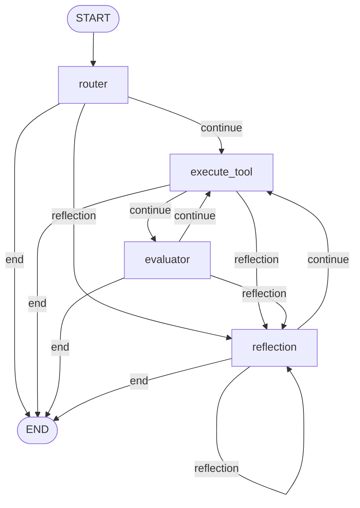
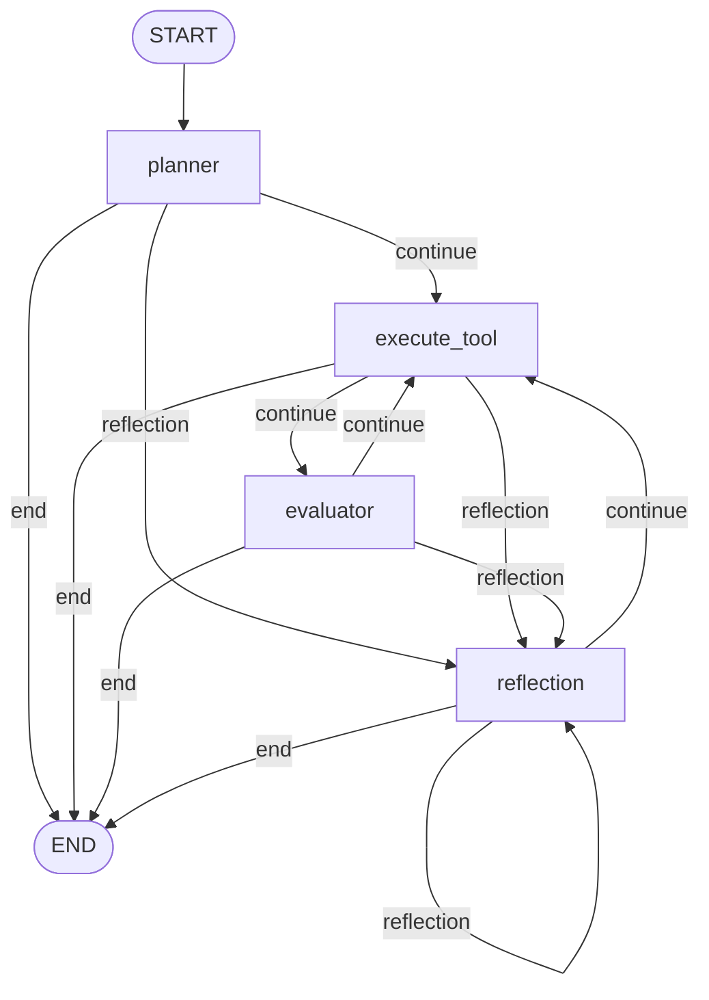

# Singular Agent Guide

Complete guide for using MASAI's single agent architecture without multi-agent complexity.

---

## Table of Contents

1. [Introduction](#introduction)
2. [Agent Architecture](#agent-architecture)
3. [Creating an Agent](#creating-an-agent)
4. [Execution Methods](#execution-methods)
5. [Agent Components](#agent-components)
6. [Memory Management](#memory-management)
7. [Tool Integration](#tool-integration)
8. [Structured Output](#structured-output)
9. [Complete Examples](#complete-examples)
10. [Best Practices](#best-practices)
11. [Troubleshooting](#troubleshooting)

---

## Introduction

A **Singular Agent** in MASAI is a standalone intelligent agent that can:
- Process queries using LLM-powered reasoning
- Execute tools to gather information
- Reflect on its progress and self-correct
- Maintain conversation memory
- Generate structured outputs

### When to Use Singular Agents

Use a single agent when:
- ✅ Your task doesn't require multiple specialized agents
- ✅ You need a simple, focused assistant
- ✅ You want to minimize complexity
- ✅ Your use case is domain-specific

Use Multi-Agent Systems when:
- ❌ You need specialized agents for different tasks
- ❌ Tasks require collaboration between agents
- ❌ You need hierarchical task decomposition

---

## Agent Architecture

MASAI agents use a **Router-Evaluator-Reflector** architecture with optional **Planner**:

```
┌─────────────────────────────────────────┐
│              User Query                 │
└─────────────────────────────────────────┘
                  ↓
┌─────────────────────────────────────────┐
│  Router (or Planner if enabled)         │
│  - Analyzes query                       │
│  - Decides: tool, delegate, or answer   │
└─────────────────────────────────────────┘
                  ↓
        ┌─────────┴─────────┐
        ↓                   ↓
┌──────────────┐    ┌──────────────┐
│ Execute Tool │    │   Reflector  │
│ - Runs tool  │    │ - Reflects   │
│ - Gets data  │    │ - Generates  │
└──────────────┘    │   answer     │
        ↓           └──────────────┘
┌──────────────┐            ↓
│  Evaluator   │    ┌──────────────┐
│ - Evaluates  │    │ Final Answer │
│   tool output│    └──────────────┘
│ - Decides    │
│   next step  │
└──────────────┘
        ↓
    (Loop or End)
```

### HOW AGENT COMPONENTS ARE CONNECTED?





### Components

1. **Router**: Analyzes query and decides next action (tool, delegate, or answer)
2. **Planner** (Optional): Creates execution plan before routing
3. **Execute Tool**: Executes selected tool and retrieves data
4. **Evaluator**: Evaluates tool output and decides if more tools needed
5. **Reflector**: Reflects on progress and generates final answer

---

## Creating an Agent

### Basic Agent

```python
from masai.AgentManager import AgentManager, AgentDetails

# Create AgentManager
manager = AgentManager(
    user_id="user_123",
    model_config_path="model_config.json"
)

# Create agent
agent = manager.create_agent(
    agent_name="assistant",
    tools=[],
    agent_details=AgentDetails(
        capabilities=["general assistance", "question answering"],
        description="A helpful AI assistant",
        style="friendly and informative"
    )
)
```

### Agent with Tools

```python
from langchain.tools import tool

@tool
def calculate(expression: str) -> str:
    """Calculate mathematical expressions"""
    return str(eval(expression))

@tool
def get_weather(city: str) -> str:
    """Get weather for a city"""
    return f"Weather in {city}: Sunny, 72°F"

agent = manager.create_agent(
    agent_name="assistant",
    tools=[calculate, get_weather],
    agent_details=AgentDetails(
        capabilities=["calculations", "weather information"],
        description="Assistant with calculation and weather tools"
    )
)
```

### Agent with Memory

```python
from masai.Memory.LongTermMemory import RedisConfig
from langchain_openai import OpenAIEmbeddings

# Configure memory backend
redis_config = RedisConfig(
    redis_url="redis://localhost:6379",
    index_name="masai_vectors",
    vector_size=1536,
    embedding_model=OpenAIEmbeddings()
)

# Create manager with memory
manager = AgentManager(
    user_id="user_123",
    model_config_path="model_config.json",
    memory_config=redis_config
)

# Create agent with persistent memory
agent = manager.create_agent(
    agent_name="assistant",
    tools=[],
    agent_details=AgentDetails(
        capabilities=["general assistance"],
        description="Assistant with persistent memory"
    ),
    persist_memory=True,  # Enable persistent memory
    memory_order=10,      # Keep last 10 messages in context
    long_context=True,    # Enable long-context summarization
    long_context_order=20 # Summarize after 20 messages
)
```

### Agent with Planner

```python
agent = manager.create_agent(
    agent_name="planner_agent",
    tools=[],
    agent_details=AgentDetails(
        capabilities=["planning", "task decomposition"],
        description="Agent with planning capabilities"
    ),
    plan=True  # Enable planner component
)
```

---

## Execution Methods

### Full Execution: `initiate_agent()`

Executes the agent and returns the complete result:

```python
result = await agent.initiate_agent(
    query="What is 2+2?",
    passed_from="user"
)

print(result["answer"])
print(result["reasoning"])
print(result["satisfied"])
```

**Returns**: `Dict` with keys:
- `answer`: Final answer string
- `reasoning`: Agent's reasoning process
- `satisfied`: Whether agent is satisfied with answer
- `messages`: Full conversation history
- `current_tool`: Last tool used (if any)
- `tool_output`: Last tool output (if any)

### Streaming Execution: `initiate_agent_astream()`

Streams state updates as the agent processes:

```python
async for state in agent.initiate_agent_astream(
    query="Tell me a story",
    passed_from="user"
):
    node_name, state_dict = state
    state_value = [v for k, v in state_dict.items()][0]
    
    print(f"Node: {state_value['current_node']}")
    
    if state_value.get("answer"):
        print(f"Answer: {state_value['answer']}")
    
    if state_value.get("current_tool"):
        print(f"Tool: {state_value['current_tool']}")
```

**Yields**: `Tuple[str, Dict]` containing:
- Node name (e.g., "router", "execute_tool", "evaluator")
- State dictionary with current agent state

---

## Agent Components

### Router

The **Router** is the entry point (unless planner is enabled):
- Analyzes the query
- Decides whether to use a tool, delegate, or answer directly
- Sets `current_tool`, `satisfied`, and `reasoning` in state

**Configuration**:
```json
{
  "router": {
    "model_name": "gemini-2.5-flash",
    "temperature": 0.3,
    "max_output_tokens": 2048
  }
}
```

### Evaluator

The **Evaluator** processes tool outputs:
- Evaluates whether tool output is sufficient
- Decides if more tools are needed
- Can trigger reflection if stuck

**Configuration**:
```json
{
  "evaluator": {
    "model_name": "gemini-2.5-flash",
    "temperature": 0.5,
    "max_output_tokens": 1024
  }
}
```

### Reflector

The **Reflector** generates final answers:
- Reflects on the entire conversation
- Synthesizes information from tools
- Generates final answer when no tools can help

**Configuration**:
```json
{
  "reflector": {
    "model_name": "gemini-2.5-flash",
    "temperature": 0.7,
    "max_output_tokens": 2048
  }
}
```

### Planner (Optional)

The **Planner** creates execution plans:
- Analyzes complex queries
- Creates step-by-step plan
- Routes to appropriate tools in sequence

**Configuration**:
```json
{
  "planner": {
    "model_name": "gemini-2.5-pro",
    "temperature": 0.4,
    "max_output_tokens": 3072
  }
}
```

**Enable planner**:
```python
agent = manager.create_agent(
    agent_name="planner_agent",
    tools=[],
    agent_details=AgentDetails(...),
    plan=True  # Enable planner
)
```

---

## Memory Management

### Short-Term Memory

Controlled by `memory_order` parameter:

```python
agent = manager.create_agent(
    agent_name="assistant",
    tools=[],
    agent_details=AgentDetails(...),
    memory_order=10  # Keep last 10 messages in context
)
```

### Long-Context Memory

Automatically summarizes old messages:

```python
agent = manager.create_agent(
    agent_name="assistant",
    tools=[],
    agent_details=AgentDetails(...),
    memory_order=10,
    long_context=True,    # Enable summarization
    long_context_order=20 # Summarize after 20 messages
)
```

**How it works**:
1. Agent keeps last `memory_order` messages in context
2. When chat history exceeds `long_context_order`, older messages are summarized
3. Summaries stored in `context_summaries`
4. Summaries included in future prompts for context

### Persistent Memory

Stores memories in Qdrant or Redis:

```python
from masai.Memory.LongTermMemory import QdrantConfig
from langchain_openai import OpenAIEmbeddings

qdrant_config = QdrantConfig(
    url="http://localhost:6333",
    collection_name="MEMORIES",
    vector_size=1536,
    embedding_model=OpenAIEmbeddings()
)

manager = AgentManager(
    user_id="user_123",
    model_config_path="model_config.json",
    memory_config=qdrant_config
)

agent = manager.create_agent(
    agent_name="assistant",
    tools=[],
    agent_details=AgentDetails(...),
    persist_memory=True  # Enable persistent storage
)
```

**Access persistent memory**:
```python
# Save memory
await agent.llm_router.long_term_memory.save(
    documents=["User prefers dark mode"],
    metadata=[{"type": "preference"}]
)

# Search memory
memories = await agent.llm_router.long_term_memory.search(
    query="user preferences",
    top_k=5
)
```

---

## Tool Integration

### Defining Tools

```python
from langchain.tools import tool

@tool
def add(a: int, b: int) -> int:
    """Add two numbers"""
    return a + b

@tool
async def fetch_data(url: str) -> str:
    """Fetch data from URL (async tool)"""
    import aiohttp
    async with aiohttp.ClientSession() as session:
        async with session.get(url) as response:
            return await response.text()
```

### Tool with Redis Caching

```python
from masai.Tools.Tool import Tool, ToolCache

# Configure cache
cache = ToolCache(
    redis_url="redis://localhost:6379",
    ttl=3600  # 1 hour
)

@tool
def expensive_computation(n: int) -> int:
    """Expensive computation"""
    return sum(range(n))

# Wrap with caching
cached_tool = Tool(
    tool=expensive_computation,
    cache=cache
)

agent = manager.create_agent(
    agent_name="assistant",
    tools=[cached_tool],
    agent_details=AgentDetails(...)
)
```

### Tool Loop Prevention

MASAI automatically prevents infinite tool loops:

```python
agent = manager.create_agent(
    agent_name="assistant",
    tools=[my_tool],
    agent_details=AgentDetails(...),
    max_tool_loop=5  # Maximum tool executions per query
)
```

---

## Structured Output

### Using Pydantic Models

```python
from pydantic import BaseModel, Field

class WeatherReport(BaseModel):
    city: str = Field(description="City name")
    temperature: float = Field(description="Temperature in Fahrenheit")
    condition: str = Field(description="Weather condition")
    humidity: int = Field(description="Humidity percentage")

# Create agent with structured output
agent = manager.create_agent(
    agent_name="weather_agent",
    tools=[],
    agent_details=AgentDetails(
        capabilities=["weather reporting"],
        description="Provides structured weather reports"
    ),
    AnswerFormat=WeatherReport  # Specify output structure
)

# Execute
result = await agent.initiate_agent(
    query="What's the weather in San Francisco?",
    passed_from="user"
)

# Result will be structured according to WeatherReport model
print(result["answer"])  # Structured WeatherReport object
```

### Complex Structured Output

```python
from typing import List

class Task(BaseModel):
    task_id: int
    description: str
    priority: str
    estimated_hours: float

class ProjectPlan(BaseModel):
    project_name: str
    tasks: List[Task]
    total_hours: float
    deadline: str

agent = manager.create_agent(
    agent_name="project_planner",
    tools=[],
    agent_details=AgentDetails(
        capabilities=["project planning"],
        description="Creates structured project plans"
    ),
    AnswerFormat=ProjectPlan
)

result = await agent.initiate_agent(
    query="Create a project plan for building a web app",
    passed_from="user"
)
```

---

## Complete Examples

### Example 1: Simple Q&A Agent

```python
import asyncio
from masai.AgentManager import AgentManager, AgentDetails

async def main():
    # Create manager
    manager = AgentManager(
        user_id="user_123",
        model_config_path="model_config.json"
    )

    # Create agent
    agent = manager.create_agent(
        agent_name="qa_assistant",
        tools=[],
        agent_details=AgentDetails(
            capabilities=["question answering", "general knowledge"],
            description="Answers general knowledge questions",
            style="concise and accurate"
        )
    )

    # Execute queries
    queries = [
        "What is the capital of France?",
        "Who wrote Romeo and Juliet?",
        "What is photosynthesis?"
    ]

    for query in queries:
        result = await agent.initiate_agent(
            query=query,
            passed_from="user"
        )
        print(f"Q: {query}")
        print(f"A: {result['answer']}\n")

asyncio.run(main())
```

### Example 2: Agent with Tools

```python
import asyncio
from masai.AgentManager import AgentManager, AgentDetails
from langchain.tools import tool

@tool
def calculate(expression: str) -> str:
    """Calculate mathematical expressions"""
    try:
        result = eval(expression)
        return str(result)
    except Exception as e:
        return f"Error: {str(e)}"

@tool
def convert_temperature(temp: float, from_unit: str, to_unit: str) -> str:
    """Convert temperature between Celsius and Fahrenheit"""
    if from_unit.lower() == "c" and to_unit.lower() == "f":
        result = (temp * 9/5) + 32
        return f"{temp}°C = {result}°F"
    elif from_unit.lower() == "f" and to_unit.lower() == "c":
        result = (temp - 32) * 5/9
        return f"{temp}°F = {result}°C"
    else:
        return "Invalid units. Use 'C' or 'F'"

async def main():
    manager = AgentManager(
        user_id="user_123",
        model_config_path="model_config.json"
    )

    agent = manager.create_agent(
        agent_name="calculator",
        tools=[calculate, convert_temperature],
        agent_details=AgentDetails(
            capabilities=["calculations", "temperature conversion"],
            description="Performs calculations and temperature conversions"
        )
    )

    # Test with tool usage
    result = await agent.initiate_agent(
        query="What is 25 Celsius in Fahrenheit?",
        passed_from="user"
    )
    print(result["answer"])

asyncio.run(main())
```

### Example 3: Agent with Streaming

```python
import asyncio
from masai.AgentManager import AgentManager, AgentDetails

async def main():
    manager = AgentManager(
        user_id="user_123",
        model_config_path="model_config.json"
    )

    agent = manager.create_agent(
        agent_name="storyteller",
        tools=[],
        agent_details=AgentDetails(
            capabilities=["storytelling", "creative writing"],
            description="Tells engaging stories"
        )
    )

    # Stream the response
    print("Streaming story generation...\n")

    async for state in agent.initiate_agent_astream(
        query="Tell me a short story about a robot learning to paint",
        passed_from="user"
    ):
        node_name, state_dict = state
        state_value = [v for k, v in state_dict.items()][0]

        current_node = state_value.get("current_node")
        print(f"[{current_node}]", end=" ")

        if state_value.get("answer"):
            print(f"\n\nFinal Answer:\n{state_value['answer']}")

asyncio.run(main())
```

### Example 4: Agent with Persistent Memory

```python
import asyncio
from masai.AgentManager import AgentManager, AgentDetails
from masai.Memory.LongTermMemory import QdrantConfig
from langchain_openai import OpenAIEmbeddings

async def main():
    # Configure persistent memory
    qdrant_config = QdrantConfig(
        url="http://localhost:6333",
        collection_name="MEMORIES",
        vector_size=1536,
        embedding_model=OpenAIEmbeddings()
    )

    manager = AgentManager(
        user_id="user_shaun",
        model_config_path="model_config.json",
        memory_config=qdrant_config
    )

    agent = manager.create_agent(
        agent_name="personal_assistant",
        tools=[],
        agent_details=AgentDetails(
            capabilities=["personal assistance", "memory recall"],
            description="Personal assistant with memory"
        ),
        persist_memory=True,
        memory_order=10,
        long_context=True,
        long_context_order=20
    )

    # First conversation
    result1 = await agent.initiate_agent(
        query="My favorite color is blue",
        passed_from="user"
    )
    print(result1["answer"])

    # Second conversation (agent remembers)
    result2 = await agent.initiate_agent(
        query="What is my favorite color?",
        passed_from="user"
    )
    print(result2["answer"])

asyncio.run(main())
```

---

## Best Practices

### 1. Agent Details

**✅ DO**: Provide clear, specific capabilities
```python
agent_details=AgentDetails(
    capabilities=["financial analysis", "budget planning", "expense tracking"],
    description="Analyzes financial data and creates budget plans",
    style="precise and data-driven"
)
```

**❌ DON'T**: Use vague descriptions
```python
agent_details=AgentDetails(
    capabilities=["general tasks"],
    description="Does stuff"
)
```

### 2. Memory Configuration

**✅ DO**: Tune memory based on use case
```python
# Short conversations
agent = manager.create_agent(..., memory_order=5)

# Long conversations
agent = manager.create_agent(..., memory_order=15, long_context=True, long_context_order=30)
```

### 3. Tool Design

**✅ DO**: Create focused, single-purpose tools
```python
@tool
def get_weather(city: str) -> str:
    """Get current weather for a city"""
    return fetch_weather_api(city)

@tool
def get_forecast(city: str, days: int) -> str:
    """Get weather forecast for a city"""
    return fetch_forecast_api(city, days)
```

**❌ DON'T**: Create overly complex tools
```python
@tool
def weather_tool(action: str, city: str, days: int = None) -> str:
    """Do everything weather-related"""
    # Too complex, hard for agent to use correctly
```

### 4. Error Handling

**✅ DO**: Handle errors gracefully
```python
try:
    result = await agent.initiate_agent(query=query, passed_from="user")
    print(result["answer"])
except ValueError as e:
    print(f"Validation error: {e}")
except Exception as e:
    print(f"Error: {e}")
```

### 5. Model Selection

**✅ DO**: Use appropriate models for each component
```json
{
  "router": {
    "model_name": "gemini-2.5-flash",  // Fast for routing
    "temperature": 0.3
  },
  "evaluator": {
    "model_name": "gemini-2.5-flash",  // Fast for evaluation
    "temperature": 0.5
  },
  "reflector": {
    "model_name": "gemini-2.5-pro",  // Powerful for final answer
    "temperature": 0.7
  }
}
```

---

## Troubleshooting

### Issue 1: Agent Not Using Tools

**Problem**: Agent answers directly instead of using available tools

**Causes**:
- Tool descriptions are unclear
- Agent capabilities don't mention tool usage
- Temperature too low

**Solutions**:
```python
# 1. Improve tool descriptions
@tool
def calculate(expression: str) -> str:
    """Calculate mathematical expressions. Use this for any math calculations.
    Examples: '2+2', '10*5', '100/4'"""
    return str(eval(expression))

# 2. Mention tools in capabilities
agent_details=AgentDetails(
    capabilities=["calculations using calculator tool"],
    description="Uses calculator tool for math"
)

# 3. Increase temperature slightly
{
  "router": {
    "temperature": 0.4  // Increase from 0.2
  }
}
```

### Issue 2: Infinite Tool Loops

**Problem**: Agent keeps calling the same tool repeatedly

**Cause**: Tool not providing useful output or agent not recognizing success

**Solutions**:
```python
# 1. Set max_tool_loop
agent = manager.create_agent(
    ...,
    max_tool_loop=3  // Limit to 3 tool calls
)

# 2. Improve tool output
@tool
def search(query: str) -> str:
    """Search for information"""
    results = perform_search(query)
    if not results:
        return "No results found. Try a different query."
    return f"Found {len(results)} results: {results}"
```

### Issue 3: Memory Not Working

**Problem**: Agent doesn't remember previous conversations

**Causes**:
- `persist_memory` not enabled
- Memory backend not configured
- `memory_order` too small

**Solutions**:
```python
# 1. Enable persistent memory
agent = manager.create_agent(
    ...,
    persist_memory=True,
    memory_order=10
)

# 2. Configure memory backend
manager = AgentManager(
    user_id="user_123",
    memory_config=redis_config  // Must pass to AgentManager
)

# 3. Increase memory_order
agent = manager.create_agent(..., memory_order=15)
```

### Issue 4: Slow Response Times

**Problem**: Agent takes too long to respond

**Causes**:
- Using slow models
- Too many tools
- Large memory context

**Solutions**:
```python
# 1. Use faster models
{
  "router": {
    "model_name": "gemini-2.5-flash"  // Faster than pro
  }
}

# 2. Reduce memory context
agent = manager.create_agent(..., memory_order=5)

# 3. Limit tools
agent = manager.create_agent(
    ...,
    tools=[essential_tool1, essential_tool2]  // Only essential tools
)
```

---

## Summary

Singular agents in MASAI provide powerful, flexible AI assistants:

| Feature | Description |
|---------|-------------|
| **Architecture** | Router-Evaluator-Reflector with optional Planner |
| **Tools** | Sync/async tool support with caching |
| **Memory** | Short-term, long-context, and persistent memory |
| **Streaming** | Real-time state updates during execution |
| **Structured Output** | Pydantic model support for typed responses |

**Next Steps**:
- [MultiAgent System Guide](MULTIAGENT_SYSTEM_GUIDE.md) - Learn about multi-agent coordination
- [Tools Guide](TOOLS_GUIDE.md) - Advanced tool integration
- [Model Parameters](MODEL_PARAMETERS.md) - Configure agent LLMs
- [Memory System](MEMORY_SYSTEM.md) - Deep dive into memory management


